# 🏗️ TruthLens System Architecture

**Complete technical architecture and data flow diagrams**

---

## 🔄 System Overview Diagram

```mermaid
flowchart TB
    Start([User Uploads Document]) --> Input[Document Image<br/>JPG/PNG]
    
    Input --> Cache{Check Cache?}
    Cache -->|Cache Hit| CachedResult[Return Cached<br/>Result ⚡]
    Cache -->|Cache Miss| Preprocess
    
    Preprocess[Preprocessing Pipeline] --> Segment{Use<br/>Segmentation?}
    Segment -->|Yes| OCR[Tesseract OCR<br/>Text Detection]
    Segment -->|No| Parallel
    OCR --> Mask[Generate Text Mask]
    Mask --> Parallel
    
    Parallel[Parallel Processing] --> ELA[ELA Detector]
    Parallel --> CopyMove[Copy-Move Detector]
    Parallel --> Font[Font Analyzer]
    
    ELA --> ELAScore[ELA Score: 0-100]
    CopyMove --> CMScore[Duplicates: N]
    Font --> FontScore[Variation: 0-100%]
    
    ELAScore --> Decision
    CMScore --> Decision
    FontScore --> Decision
    
    Decision{Decision Engine<br/>2/3 Voting} --> Evaluate
    
    Evaluate[Evaluate Thresholds] --> Count[Count Suspicious<br/>Detectors]
    
    Count --> Final{Suspicious<br/>Count ≥ 2?}
    
    Final -->|Yes| Fraud[🚨 FRAUD DETECTED]
    Final -->|No| Authentic[✅ AUTHENTIC]
    
    Fraud --> Report
    Authentic --> Report
    
    Report[Generate Report] --> SaveCache[Save to Cache]
    SaveCache --> Output[Return Results<br/>to User]
    CachedResult --> Output
    
    Output --> End([Display Results])
    
    style Start fill:#e1f5ff
    style End fill:#e1f5ff
    style Fraud fill:#ffebee
    style Authentic fill:#e8f5e9
    style Cache fill:#fff3e0
    style Decision fill:#f3e5f5
    style Output fill:#e0f2f1
```

---

## 🔍 Detailed Component Architecture

---

## 📊 Data Flow Diagram

---

## 🧩 Module Dependency Graph

---

## ⚙️ Processing Pipeline Details

### Stage 1: Preprocessing (0.69s - 32%)

**Purpose:** Identify text regions to reduce false positives in copy-move detection

**Impact:**
- 48-64% false positive reduction
- 59% speed improvement (counterintuitive!)

---

### Stage 2: ELA Detection (0.11s - 5%)

```mermaid
flowchart LR
    A[Original Image] --> B[Recompress at 95% JPEG]
    B --> C[Calculate Pixel Differences]
    C --> D[Normalize to 0-100 Scale]
    D --> E{Score > 50?}
    E -->|Yes| F[Suspicious ⚠️]
    E -->|No| G[Clean ✅]
    
    style F fill:#ffebee
    style G fill:#e8f5e9
```

**Detects:** Photoshop edits, image manipulation  
**Threshold:** 50/100  
**FBI Standard:** 95% JPEG quality

---

### Stage 3: Copy-Move Detection (0.60s - 28%)

```mermaid
flowchart LR
    A[Divide into 16x16 Blocks] --> B[Apply Text Mask]
    B --> C[Compare All Block Pairs]
    C --> D[Count Duplicates]
    D --> E{Duplicates > 5?}
    E -->|Yes| F[Suspicious ⚠️]
    E -->|No| G[Normal ✅]
    
    style B fill:#9C27B0
    style F fill:#ffebee
    style G fill:#e8f5e9
```

**Detects:** Copied signatures, logos, image regions  
**Innovation:** Text exclusion via segmentation  
**Threshold:** 5 duplicates

---

### Stage 4: Font Analysis (0.77s - 35%)

```mermaid
flowchart LR
    A[Run Tesseract OCR] --> B[Extract Font Sizes]
    B --> C[Calculate Std Deviation]
    C --> D[Convert to Percentage]
    D --> E{Variation > 30%?}
    E -->|Yes| F[Suspicious ⚠️]
    E -->|No| G[Consistent ✅]
    
    style F fill:#ffebee
    style G fill:#e8f5e9
```

**Detects:** Text tampering, mixed fonts  
**Bottleneck:** Slowest component (35% of time)  
**Threshold:** 30% variation

---

### Stage 5: Decision Engine

```mermaid
flowchart TB
    A[Collect 3 Scores] --> B[Check ELA > 50]
    A --> C[Check Copy-Move > 5]
    A --> D[Check Font > 30%]
    
    B --> E[Count Suspicious]
    C --> E
    D --> E
    
    E --> F{Count >= 2?}
    
    F -->|Yes| G[FRAUD DETECTED 🚨]
    F -->|No| H[AUTHENTIC ✅]
    
    G --> I[Calculate Confidence]
    H --> I
    
    I --> J[Generate Report]
    
    style G fill:#ffebee
    style H fill:#e8f5e9
    style F fill:#f3e5f5
```

**Logic:** 2 out of 3 detectors must agree  
**Rationale:** Reduces false positives while maintaining sensitivity  
**Confidence:** Weighted average of all scores

---

## 🔄 Caching System Architecture

**Performance:**
- Cache hit: ~0.001 seconds (2,160x faster!)
- Cache storage: ~2KB per document
- Hit rate: 100% on repeated documents
- Overall speedup: 2.4x on typical workloads

---

## 📦 Deployment Architecture

---

## 🎯 Performance Optimization Points

```mermaid
graph TD
    A[Original System<br/>No Optimization] --> B[Add Segmentation<br/>59% Faster ✅]
    
    B --> C[Add Caching<br/>2.4x Faster ✅]
    
    C --> D[Future: PaddleOCR<br/>3x Faster 🔜]
    
    D --> E[Future: Parallel<br/>1.5x Faster 🔜]
    
    E --> F[Future: GPU Acceleration<br/>5x Faster 🔜]
    
    style B fill:#4CAF50
    style C fill:#4CAF50
    style D fill:#FFC107
    style E fill:#FFC107
    style F fill:#FFC107
```

**Current:** 2.16s per document  
**With all optimizations:** ~0.15s per document (14x improvement potential)

---

## 📊 Scalability Architecture

**Capacity Roadmap:**
- Phase 1: ~40K docs/day (current)
- Phase 2: ~400K docs/day (queue)
- Phase 3: ~1.6M docs/day (multi-worker)
- Phase 4: Unlimited (cloud scale)

---

## 🔐 Security Architecture (Future)

**Security Features (Planned):**
- Authentication (JWT tokens)
- Rate limiting (100 requests/hour/user)
- File validation (type, size, virus scan)
- Audit logging (who, what, when)
- Data encryption (at rest and in transit)

---

## 📈 Monitoring & Observability (Future)

**Metrics to Track:**
- Processing time per document
- Throughput (docs/sec)
- Error rates
- Cache hit rates
- User activity
- System resources (CPU, RAM, disk)

---

## 🧪 Testing Architecture

---

## 📚 Documentation Architecture

---

## 🎯 Technology Stack Summary

| Layer | Technologies | Purpose |
|-------|-------------|---------|
| **Core Language** | Python 3.8+ | Main development |
| **Computer Vision** | OpenCV 4.x | Image processing |
| **OCR** | Tesseract 5.x | Text recognition |
| **Numerical** | NumPy | Array operations |
| **Image Processing** | Pillow (PIL) | Image manipulation |
| **Web UI** | Gradio 3.x | User interface |
| **CLI** | Click 8.x | Command-line tool |
| **Caching** | JSON + MD5 | Result storage |
| **Documentation** | Markdown + Mermaid | Diagrams & docs |

---

## 🔮 Future Architecture Vision

---

**END OF ARCHITECTURE DOCUMENTATION**

*These diagrams can be rendered in:*
- *GitHub (automatic Mermaid rendering)*
- *VS Code (with Mermaid extension)*
- *Online: https://mermaid.live/*
- *Thesis (export as PNG/SVG)*